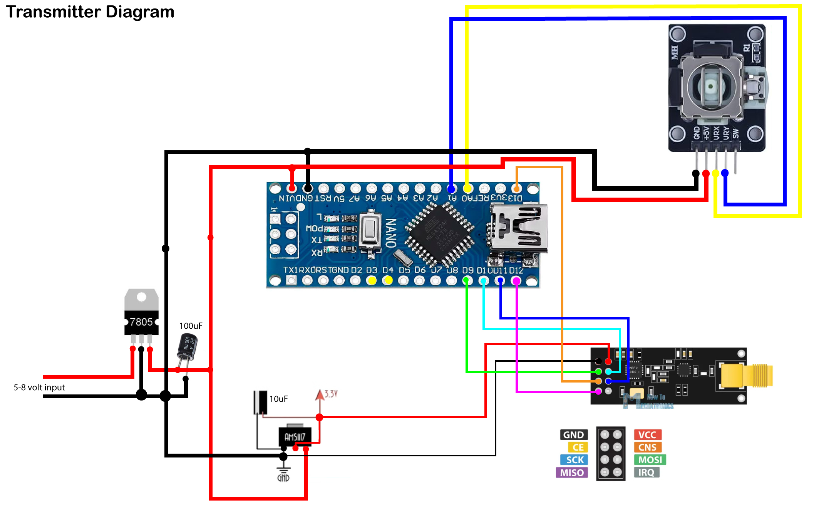
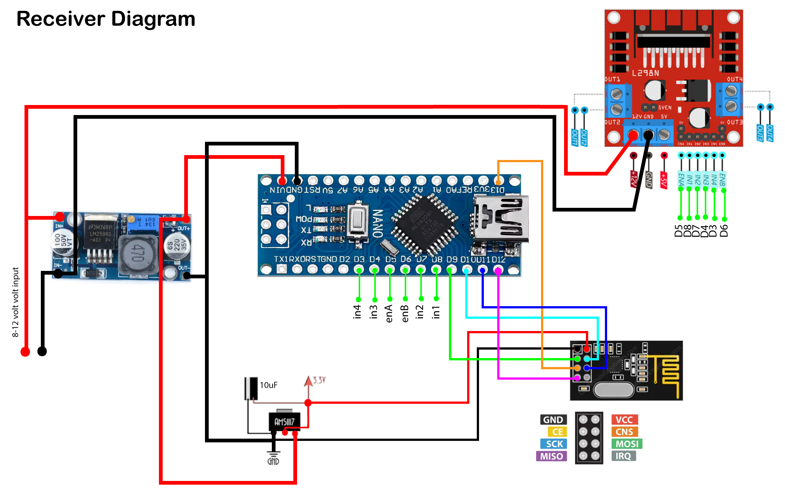

# 🚗 RC Car Project - Wireless Control System with Arduino Nano, nRF24L01, and Joystick

## Project Overview

This project is a **Wireless RC Car** built using **Arduino Nano**, **nRF24L01 transceivers**, a **joystick module**, **L298N motor driver**, and regulated power supplies. The car can be controlled remotely using the joystick which sends directional commands wirelessly to the car.

The system consists of two main components:

1. **Transmitter**: Joystick controller that sends control signals
2. **Receiver**: Car unit that receives signals and controls motors

## 📦 Components Used

### Transmitter Side:
- Arduino Nano
- Joystick Module (with X, Y, and switch pin)
- nRF24L01 with external antenna
- AMS1117 3.3V voltage regulator (for nRF24L01)
- 7805 Voltage Regulator (for powering Arduino)
- Capacitors: 100µF (for 7805), 10µF (for AMS1117)
- Power input: 5–8V
- Breadboard or PCB
- Jumper wires

### Receiver Side:
- Arduino Nano
- L298N Motor Driver
- nRF24L01 Module
- AMS1117 3.3V Voltage Regulator (for nRF24L01)
- Buck Converter (for 5V regulated supply to Arduino & Motor Driver)
- Power input: 8–12V
- DC Motors (2 or 4 wheel drive supported)
- Chassis/Frame
- 2-4x Wheels
- Jumper wires

## 📡 Working Principle

- The **joystick module** on the transmitter reads the analog X and Y-axis positions.
- Arduino reads these values and sends them wirelessly using the **nRF24L01 module**.
- On the receiver side, the Arduino receives the joystick values and maps them to **motor directions** via the **L298N motor driver**.
- The car responds by moving **forward, backward, left, or right**.
- Speed can be controlled using PWM on ENA and ENB pins.

## System Architecture

### 🔼 Transmitter Unit
- **Microcontroller**: Arduino Nano (5V, 16MHz)
- **Wireless Module**: nRF24L01 with external antenna
- **Input Device**: Analog joystick (X and Y axis)
- **Communication**: 2.4GHz wireless transmission
- **Power Regulation**: 7805 (5V) + AMS1117 (3.3V for nRF24L01)

### 🔽 Receiver Unit
- **Microcontroller**: Arduino Nano (5V, 16MHz)
- **Wireless Module**: nRF24L01
- **Motor Control**: L298N Motor Driver (or similar H-bridge)
- **Motors**: 2x DC Geared Motors (Left and Right) - supports 4WD
- **Safety Features**: Signal timeout protection
- **Power System**: Buck converter + AMS1117 regulation

## 📊 Circuit Diagram Analysis

### 🔼 Transmitter Circuit (Transmitter-Diagram.jpg)
The transmitter circuit includes:
- **Arduino Nano** as the main controller
- **nRF24L01 Module** for wireless communication with external antenna
- **Analog Joystick** with X, Y axis and optional switch
- **Power Supply**: 5-8V input, regulated to 5V (7805) and 3.3V (AMS1117)
- **Voltage Regulation**: Proper capacitor filtering for stable operation

**Key Connections:**
- **Joystick Connections:**
  - VCC → 5V
  - GND → GND
  - VRx → A0 (X-axis)
  - VRy → A1 (Y-axis)
  - SW (optional switch) → A2 (not used in current code)

- **Power Regulation:**
  - 5–8V input regulated by 7805 to 5V for Arduino
  - AMS1117 converts 5V to 3.3V for nRF24L01
  - 100µF capacitor stabilizes 7805 output
  - 10µF capacitor stabilizes AMS1117

### 🔽 Receiver Circuit (Receiver-Diagram.jpg)
The receiver circuit includes:
- **Arduino Nano** as the main controller
- **nRF24L01 Module** for wireless communication
- **L298N Motor Driver** for controlling DC motors
- **2x DC Motors** (left and right wheels) - expandable to 4WD
- **Power Supply**: 8-12V input with buck converter and voltage regulation

**Key Connections:**
- **L298N Motor Driver:**
  - IN1 → D6 (updated from original pin 8)
  - IN2 → D7
  - ENA → D5 (PWM enabled for speed control)
  - IN3 → D4
  - IN4 → D3
  - ENB → D8 (PWM enabled for speed control)
  - 12V Power input for motors
  - 5V regulated supply for logic

- **Power System:**
  - 8–12V input to buck converter
  - Buck converter provides 5V output to Arduino and Motor Driver logic
  - Motors powered directly from 12V
  - AMS1117 provides stable 3.3V for nRF24L01

## Detailed Pin Connections

### nRF24L01 Wiring (Both Transmitter and Receiver)
```
nRF24L01    Arduino
--------    -------
GND      →  GND
VCC      →  3.3V (IMPORTANT: Use voltage regulator!)
CE       →  Digital Pin 9
CSN      →  Digital Pin 10
SCK      →  Digital Pin 13
MOSI     →  Digital Pin 11
MISO     →  Digital Pin 12
```

### Transmitter Additional Connections
```
Joystick    Arduino Nano
--------    ------------
VCC      →  5V
GND      →  GND
VRx      →  A0 (X-axis) - Updated mapping
VRy      →  A1 (Y-axis) - Updated mapping
SW       →  A2 (optional switch - not used in current code)
```

### Receiver Additional Connections (Updated Pin Mapping)
```
L298N       Arduino Nano
-----       ------------
IN1      →  Digital Pin 6 (Updated from pin 8)
IN2      →  Digital Pin 7
IN3      →  Digital Pin 4
IN4      →  Digital Pin 3
ENA      →  Digital Pin 5 (PWM enabled for speed control)
ENB      →  Digital Pin 8 (PWM enabled for speed control)
VCC      →  5V (from buck converter)
GND      →  GND
12V      →  External Power Supply (8-12V to motors)
```

**Note**: The receiver code uses pins 8,7,4,3 for motor control, but the updated circuit diagram shows pins 6,7,4,3 with PWM capability on pins 5 and 8 for speed control.

## Code Functionality

### Transmitter Code Features
- Reads analog joystick values (0-1023 range)
- Transmits X,Y coordinates as comma-separated string
- Serial debugging for monitoring transmission status
- 200ms transmission interval for stability

### Receiver Code Features
- Receives joystick data via nRF24L01
- Parses X,Y coordinates from received string
- Implements safety timeout (500ms) - stops motors if signal lost
- Motor control logic:
  - **Forward**: Y > 600
  - **Backward**: Y < 500
  - **Turn Right**: X < 500
  - **Turn Left**: X > 600
  - **Pivot Turns**: When only turning (no forward/backward)
  - **Differential Steering**: Combines forward/backward with turning
- **Speed Control**: PWM capability on ENA (pin 5) and ENB (pin 8) for variable speed

## ⚙️ Project Outcome

- Use the joystick to move the car:
  - **Forward, Backward, Left, Right**
  - **Speed can be controlled using PWM on ENA and ENB**
  - **Real-time responsive control** with nRF24L01 wireless communication
  - **Safety timeout** prevents runaway if signal is lost

## Required Components

### Transmitter
- 1x Arduino Nano
- 1x nRF24L01 Wireless Module with external antenna
- 1x Analog Joystick Module (with X, Y, and switch pin)
- 1x AMS1117 3.3V voltage regulator
- 1x 7805 Voltage Regulator
- 1x 100µF Capacitor (for 7805 stability)
- 1x 10µF Capacitor (for AMS1117 stability)
- 1x Breadboard or PCB
- Jumper wires
- 1x Power source (5-8V battery pack or regulated supply)

### Receiver
- 1x Arduino Nano
- 1x nRF24L01 Wireless Module
- 1x L298N Motor Driver Module
- 1x AMS1117 3.3V Voltage Regulator
- 1x Buck Converter (for 5V regulated supply)
- 2x DC Geared Motors (expandable to 4 motors for 4WD)
- 1x Chassis/Frame
- 2-4x Wheels
- 1x Battery Pack (8-12V for motors and system power)
- Heat sinks (optional, for voltage regulators)
- Jumper wires

## ⚠️ IMPORTANT PRECAUTIONS AND SAFETY GUIDELINES

### Before Assembly
1. **Component Testing**: Test each component individually before integration:
   - Test Arduino boards with simple blink programs
   - Verify nRF24L01 modules with basic communication examples
   - Test joystick readings with analog input examples
   - Test motor driver with simple motor control code
   - **Pre-test each component separately to avoid integration issues**

2. **Voltage Regulation Critical Points**:
   - **CRITICAL**: nRF24L01 operates at 3.3V ONLY - never connect to 5V!
   - **Always use AMS1117 regulated 3.3V supply** and not Arduino's 3.3V pin
   - Use proper capacitor filtering (100µF for 7805, 10µF for AMS1117)
   - Verify voltage levels with a multimeter before connecting
   - **nRF24L01 is very sensitive to voltage fluctuations**

### Circuit Assembly Precautions

3. **Connection Verification**:
   - **Double-check all connections against the circuit diagram**
   - Use a multimeter to verify continuity
   - **Test connections multiple times before powering on**
   - Take photos of your wiring for reference
   - **Check wiring multiple times** - this cannot be overstated

4. **Power Connection Safety**:
   - **Always connect power LAST**
   - Start with low voltage (5V) before connecting motor power
   - **Use separate power supplies for motors and logic circuits**
   - Install fuses or current limiters where possible
   - **Ensure proper isolation between motor power and logic power**

5. **Short Circuit Prevention**:
   - **Visually inspect all connections for shorts**
   - **Check that no bare wires are touching**
   - **Ensure wires and terminals are not touching unintentionally**
   - Use heat shrink tubing or electrical tape on exposed connections
   - **Secure wiring using insulating tape** or proper connectors
   - Test with multimeter in continuity mode

6. **Common Ground Requirements**:
   - **All modules must share a common GND** for proper communication
   - Verify ground connections between all components
   - Use star grounding where possible to reduce noise

### Testing Procedure

7. **Staged Testing Approach**:
   - **Stage 1**: Test Arduino and nRF24L01 communication only
   - **Stage 2**: Add joystick and verify data transmission
   - **Stage 3**: Test motor driver with manual commands
   - **Stage 4**: Integration testing with full system
   - **Upload code before final wiring** to avoid connection errors

8. **Power-On Sequence**:
   - Connect Arduino power first
   - Verify serial communication works
   - Connect motor power supply last
   - Monitor current consumption

9. **Heat Management**:
   - **Use proper heat sinks** for 7805 regulator during extended use
   - **Attach heatsink to avoid overheating** if using 7805 for long durations
   - Monitor component temperatures during operation

### Operational Safety

10. **Runtime Precautions**:
    - Never leave the system unattended while powered
    - Implement emergency stop mechanisms
    - Monitor for overheating components
    - Keep spare fuses available

11. **Signal Safety**:
    - Test radio range in safe environment first
    - Verify timeout safety feature works
    - Always have manual override capability

## 📁 Recommended Folder Structure

```bash
RC_Car_Project/
├── README.md
├── transmitter/
│   └── transmitter.ino
├── receiver/
│   └── receiver.ino
├── images/
│   ├── Transmitter-Diagram.jpg
│   └── Receiver-Diagram.jpg
├── datasheets/
│   ├── nRF24L01_datasheet.pdf
│   ├── L298N_datasheet.pdf
│   └── AMS1117_datasheet.pdf
```

## 📸 Circuit Diagrams

**Transmitter Circuit:**


**Receiver Circuit:**


## Troubleshooting

### Common Issues
1. **No Communication**: Check nRF24L01 power (3.3V) and connections
2. **Motors Not Responding**: Verify motor driver connections and power supply
3. **Erratic Movement**: Check for loose connections or interference
4. **Signal Loss**: Verify antenna orientation and range limitations

### Debugging Tools
- Use Serial Monitor for both transmitter and receiver
- Check voltage levels with multimeter
- Verify component functionality individually

## Library Dependencies

Install the following libraries in Arduino IDE:
- `RF24` by TMRh20
- `SPI` (built-in)

## Upload Instructions

1. Install required libraries
2. Upload `transmitter.ino` to transmitter Arduino
3. Upload `receiver.ino` to receiver Arduino
4. Open Serial Monitor (9600 baud) for debugging

## Performance Specifications

- **Communication Range**: ~100 meters (line of sight)
- **Control Latency**: ~200ms
- **Safety Timeout**: 500ms
- **Operating Frequency**: 2.4GHz
- **Power Consumption**: 
  - Transmitter: ~50mA
  - Receiver: ~100mA (without motors)

## Future Enhancements

- Add speed control using PWM
- Implement acceleration/deceleration curves
- Add LED indicators for status
- Include battery voltage monitoring
- Add obstacle detection sensors

## License

This project is open-source. Feel free to modify and distribute.

## Support

For questions or issues, refer to the code comments or contact the project maintainer.

---

**⚠️ REMEMBER**: Always prioritize safety when working with electronics. When in doubt, disconnect power and re-verify your connections!
